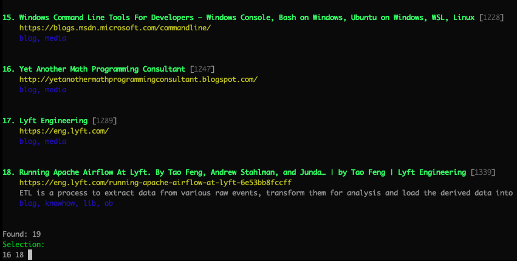

# twbm: Bookmarks via Commandline (CLI)

[![PyPI Version][pypi-image]][pypi-url]

[sysid blog: twbm](https://sysid.github.io/twbm/)

Inspired by https://github.com/jarun/buku.

Why not just use buku?

- open general URI, i.e. also local files/directories
- better full-text search.
- check tags for consistency when adding new bookmark
- alphabetical ordering of `deep` search results
- no tools like bukuserver, only CLI

If you are happy using [buku](https://github.com/jarun/buku), by all means stick with it. It is battle tested.

[twbm](https://github.com/sysid/twbm) is 100% buku compatible.   
Switch back and forth between **twbm** and **buku** is possible without data loss.

To harness `twbm`'s power, use correct FTS search syntax (see: https://www.sqlite.org/fts5.html chapter 3). 

## Usage
Two complementary commands are provided:
1. **twbm**: CLI tool with FTS for bookmark management
2. **twbuku**: 100% buku with small enhancements and usage of an enhanced database

This allows to use the battle-tested buku interface where preferred and still benefit from additional features 
while using one enhanced bookmark database.

Getting help: `twbm --help`

### Examples
```bash
# FTS examples (https://www.sqlite.org/fts5.htm)
twbm search 'security "single-page"'
twbm search '"https://securit" *'
twbm search '^security'
twbm search 'postgres OR sqlite'
twbm search 'security NOT keycloak'

# FTS combined with tag filtering
twbm search -t tag1,tag2 -n notag1 <searchquery>

# Match exact taglist
twbm search -e tag1,tag2

# Search -> select interactively -> pipe bookmark id downstream for processing
twbm search xxxxx | twbm update -t x

# Search by any tag and sort by bookmark age ascending
twbm search -T tag1,tag2 -O

# Adding URI to local files
twbm add /home/user/presentation.pptx tag1,tag2 --title 'My super Presentation'
```
Tags must be separated by comma without blanks.
When adding an generic URI, which is not starting with 'http', the hint 'Malformed URL' can be ignored.

Selection of multiple bookmarks for opening in browser is possible, of course:


After selection the program ends and returns to the command line prompt.


## Installation
```bash
pipx twbm
```
Database schema upgrade:  
- To upgrade existing buku-db: `twbm-upgrade-db.sh buku.db twbm.db`.  
- To downgrade twbm-db: `twbm-downgrade-db.sh twbm.db buku.db`.  

All transactions do not affect existing databases.

Tested configuration:  
- sqlite 3.36.0 (requires update on macOS)
- macOS 10.15.7

## Configuration
Location of sqlite database:
```bash
# aliases which I use
alias b="twbuku --db $HOME/bm.db -n 1000 --deep"  # using patched original buku

alias bb="TWBM_DB_URL=sqlite:////$HOME/bm.db twbm search"  # using extended CLI tool
alias bbb="TWBM_DB_URL=sqlite:////$HOME/bm.db twbm"
```

## Architecture
**twbm** uses a few `buku` functions in the background, but is generally rebuilt on top of: 
-  [Typer](https://typer.tiangolo.com/)  
-  [Pydantic](https://pydantic-docs.helpmanual.io/)  
-  [SQLite FTS5](https://www.sqlite.org/fts5.html)  
-  [aiosql](https://nackjicholson.github.io/aiosql/)  
-  [SQLAlchemy](https://www.sqlalchemy.org/)  
-  [alembic](https://alembic.sqlalchemy.org/en/latest/index.html)  
  
This should make it easy to extend and add functionality in an object-oriented manner.


# Development
## patch buku
- download `buku` and compare with `buku.py`
- update `buku.py`: `# tw: add title tagging` (customization: search for `# tw`)
- GOTCHA: Exclude `buku.py` from `black`
```bash
rm buku
wget https://raw.githubusercontent.com/jarun/buku/master/buku .
black buku
diff buku.py buku
```

## Local installation from sources
- install twbm with pipx for local development: `pipx install ~/dev/py/twbm`, via `make install`
- uninstall: `pipx uninstall twbm`  # GOTCHA: NOT THE PATH !!!!

## Testing
`make test`

### Piping
Pycharm run configuration interferes with piping. Testing/Running only possible on CLI.
This affects the following commands: `open, update`

## Roadmap
- tbd

<!-- Badges -->
[pypi-image]: https://img.shields.io/pypi/v/twbm?color=blue
[pypi-url]: https://pypi.org/project/twbm/
[build-image]: https://github.com/sysid/twbm/actions/workflows/build.yml/badge.svg
[build-url]: https://github.com/sysid/twbm/actions/workflows/build.yml
[coverage-image]: https://codecov.io/gh/sysid/twbm/branch/main/graph/badge.svg
[coverage-url]: https://codecov.io/gh/sysid/twbm
[quality-image]: https://api.codeclimate.com/v1/badges/3130fa0ba3b7993fbf0a/maintainability
[quality-url]: https://codeclimate.com/github/nalgeon/podsearch-py
